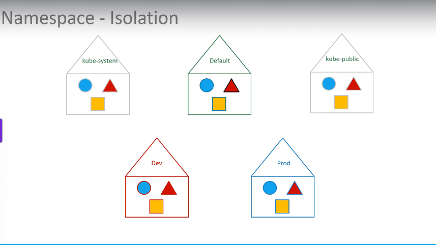

# Namespaces

Udemy Video Link: <https://udemy.com/course/certified-kubernetes-administrator-with-practice-tests/learn/lecture/14295510#content>

## Notes



- Default namespace is created automatically during setup by k8s.
- kubenetes created a protected namespace called kube-system
- kube-public - made available for all users.

  - if you're deploying your own, you can use default namespace. however, it would be ideal to create your own.

- each namespace can have it's own set of policies
  - such as restricted resources allotted
- if you wish to connect to another namespace, such as dev from default, you must use mysql.connect('<pod_name>.dev.svc.cluster.local")
  - when a service is created, a DNS entry is added in this format.

```yaml
kubectl create -f pod-definition.yml --namespace=dev
```

if you want it to be created in a namespace, add it here:

```yaml
apiVersion: v1
kind: Namespace
metadata:
  name: dev
```

- to limit resources in a namespace, create a "resource quota"
- kubectl create -f compute-quota.yml, like this:

```yaml
apiVersion: v1
kind: ResourceQuota
metadata:
    name: compute-quota
    namespace: dev
spec:
    hard:
        pods: "10"
        requests.cpu: "4"
        requests.cpu: "10"
        limits.memory: 10Gi
```
