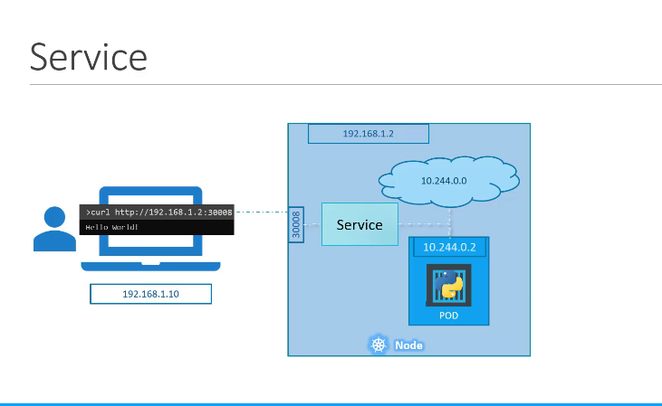
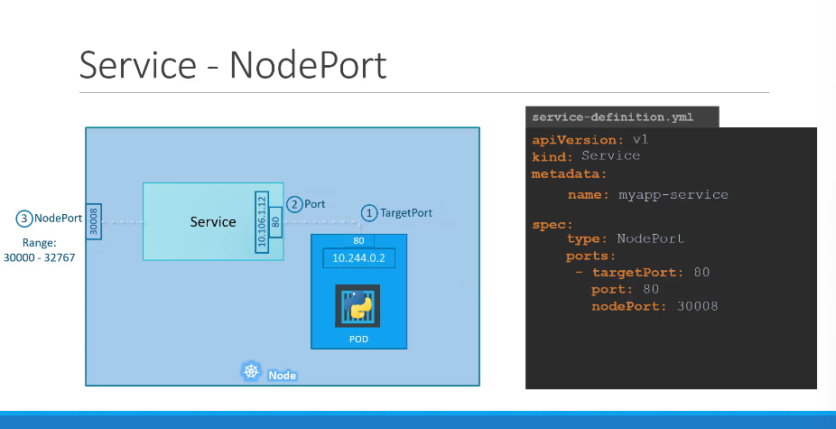

# Services

[Udemy Video Link](https://udemy.com/course/certified-kubernetes-administrator-with-practice-tests/learn/lecture/14295512#content)



## Notes

- Services enable connectivity between different pods within a cluster.
- Types of Services:
  - **ClusterIP**: Provides a stable internal IP address for a set of pods.
  - **NodePort**: Exposes a service on a static port on each node's IP.
  - **LoadBalancer**: Provisions an external load balancer to distribute traffic.

### NodePort



- Used to access the web server externally.
- NodePorts must be within the range 30000 to 32767.

#### Creating a NodePort Service

```yaml
apiVersion: v1
kind: Service
metadata:
  name: myapp-service
spec:
  type: NodePort
  ports:
    - targetPort: 80
      port: 80
      nodePort: 30008 # Exposed externally
  selector: # Links the service to the pod
    app: myapp
    type: front-end
```

Considerations:
- The `port` field is mandatory.
- Multiple port mappings can be defined for a single service.

### ClusterIP

[Udemy Video Link](https://udemy.com/course/certified-kubernetes-administrator-with-practice-tests/learn/lecture/14295514#content)

- Default service type, providing a single interface for pods to communicate internally.

#### Creating a ClusterIP Service

```yaml
apiVersion: v1
kind: Service
metadata:
  name: back-end
spec:
  type: ClusterIP
  ports:
    - targetPort: 80 # Backend is exposed
      port: 80 # Service is exposed
  selector: # Links the service to a set of pods
    app: myapp
    type: back-end
```

```bash
kubectl create -f service-definition.yaml
kubectl get services
```

### LoadBalancer

- Supports native integration with cloud platforms like AWS, GCP, and Azure.
  - Note: It won't work in unsupported environments.

#### Creating a LoadBalancer Service

```yaml
apiVersion: v1
kind: Service
metadata:
  name: myapp-service
spec:
  type: LoadBalancer
  ports:
    - targetPort: 80 # Backend is exposed
      port: 80 # Service is exposed
      nodePort: 30008
```
