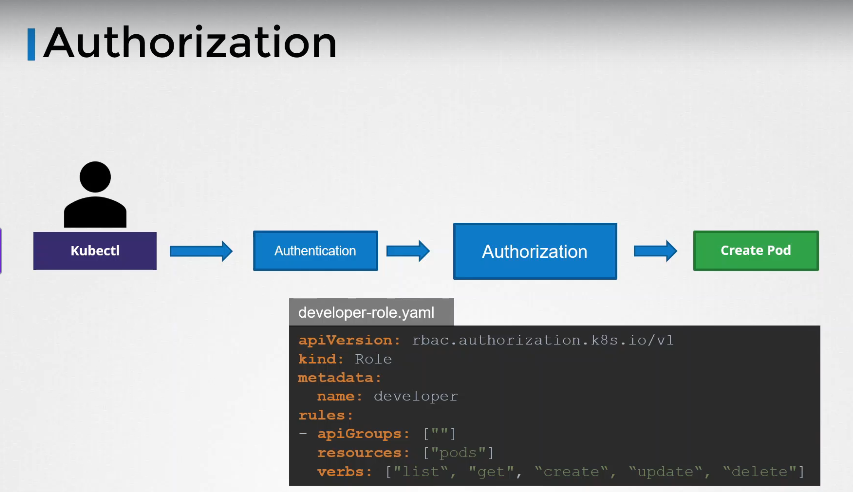
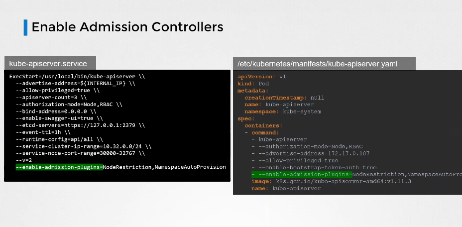

# Admission Controllers

[Udemy Video Link](https://udemy.com/course/certified-kubernetes-administrator-with-practice-tests/learn/lecture/48276491#content)

[Lab Link](https://learn.kodekloud.com/user/courses/udemy-labs-certified-kubernetes-administrator-with-practice-tests/module/8e4261a6-bac4-4dfe-82c5-0a1bb8c527da/lesson/d9398583-1f11-4b74-a8ee-2bc0790f3193)

## Notes



- With RBAC, you can restrict access to specific resource names, namespaces, and control the ability to create, list, and delete pods, deployments, services, etc.

- Admission Controllers enhance security by enforcing controls that cannot be achieved with RBAC alone.

  - Examples include:
    - AlwaysPullImages
    - DefaultStorageClass
    - EventRateLimit
    - NamespaceExists
    - NamespaceAutoProvision (Note: NamespaceExists and NamespaceAutoProvision are deprecated and replaced by NamespaceLifecycle)
    - Several others, but these are key ones

- Admission Controllers can modify the request itself during processing.
- Admission Controller checks occur after a command has been authenticated and authorized.

- To check which plugins are enabled:

  ```sh
  kube-apiserver -h | grep enable-admission-plugins
  ```

- Enabling admission controllers:
  
