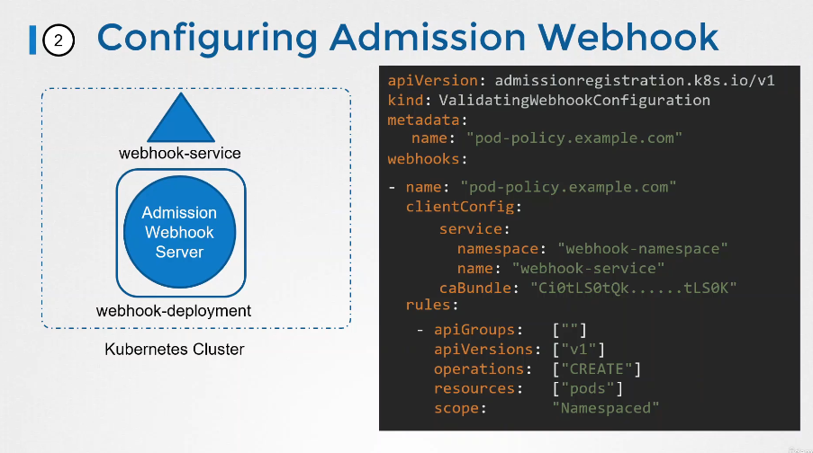

# Validating Admission Controllers

Udemy Video Link: https://udemy.com/course/certified-kubernetes-administrator-with-practice-tests/learn/lecture/48276505#content

Lab Link: https://learn.kodekloud.com/user/courses/udemy-labs-certified-kubernetes-administrator-with-practice-tests/module/8e4261a6-bac4-4dfe-82c5-0a1bb8c527da/lesson/1f3b6bb8-1b60-486a-b7da-08c8c33d8508

## Notes

- mutating admission controllers are those that can change the requests - NamespaceAutoCreation
- validating admission controllers validate the requests that are coming in. - NamespaceExists
- flow of admission controllers - mutate first then validate

- example webhook configuration that'll be called when pods are needed to be created.