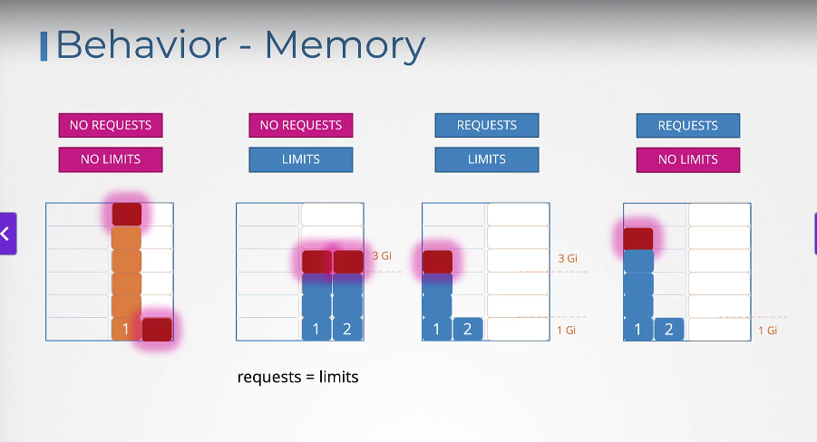

# Resource Requirements

[Udemy Video Link](https://udemy.com/course/certified-kubernetes-administrator-with-practice-tests/learn/lecture/14298678#content)

[Lab Link]()

## Notes

- If no requests and no limits are set, the pod can exceed resource usage, which is not ideal.
- If no requests but limits are set, then requests equal limits.
- If both requests and limits are set, there may be conflicts.
- Requests without limits are the most ideal, as requests will be guaranteed for all pods, minimizing issues.

### Resource Requests Image


### Behavior for Memory



### Example Pod Definition with Resource Limits

```yaml
apiVersion: v1
kind: Pod
metadata:
    name: resource-limits-pod
spec:
    containers:
    - name: my-container
        image: nginx
        resources:
            requests:
                memory: "64Mi"
                cpu: "250m"
            limits:
                memory: "128Mi"
                cpu: "500m"
```

- When a pod tries to exceed the specified CPU limit, it will throttle the CPU.
  - If it tries to use more memory, the pod will be terminated, resulting in an Out Of Memory error.

### Limit Range

- LimitRange can help define default values without setting personal limits, applicable at the namespace level.
- Limits are enforced when pods are created and do not affect existing pods.

```yaml
apiVersion: v1
kind: LimitRange
metadata:
    name: resource-limits
    namespace: default
spec:
    limits:
    - max:
            cpu: "1"
            memory: "512Mi"
        min:
            cpu: "200m"
            memory: "256Mi"
        default:
            cpu: "500m"
            memory: "256Mi"
        defaultRequest:
            cpu: "250m"
            memory: "128Mi"
        type: Container
```

- This LimitRange object sets default, minimum, and maximum resource limits for containers in the `default` namespace.

### Resource Quotas

- ResourceQuota sets a namespace-level resource limit that defines the maximum resources consumed by all pods in the namespace.

```yaml
apiVersion: v1
kind: ResourceQuota
metadata:
  name: resource-quota
  namespace: default
spec:
  hard:
    pods: "10"
    requests.cpu: "4"
    requests.memory: "2Gi"
    limits.cpu: "8"
    limits.memory: "4Gi"
```

- This ResourceQuota object sets a maximum limit on the number of pods, CPU, and memory resources that can be consumed by all pods in the `default` namespace.
