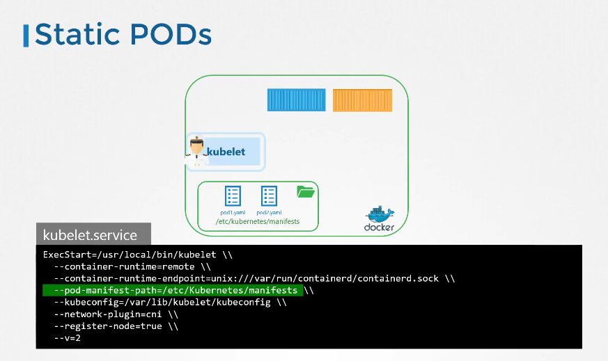
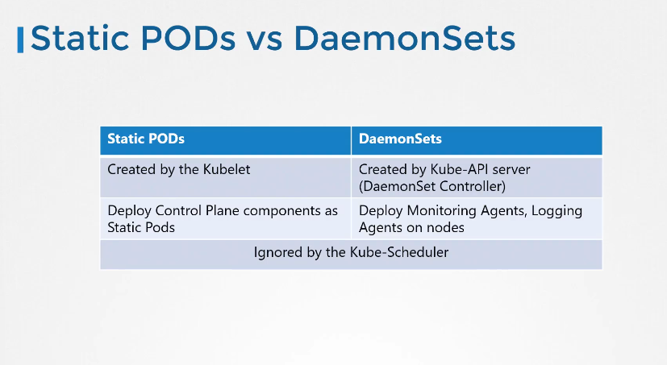

# Static Pods

[Udemy Video Link](https://udemy.com/course/certified-kubernetes-administrator-with-practice-tests/learn/lecture/14863335#content)

[Lab Link](https://uklabs.kodekloud.com/topic/practice-test-static-pods-2/)

## Notes

- Static Pods are managed directly by the kubelet daemon on a specific node, without requiring the API server. They are defined in individual configuration files and are useful for cluster bootstrap or running critical system components. Unlike regular pods, static pods are not associated with any replication controller, deployment, or other higher-level Kubernetes object.
  - The designated folder can be any directory on the host machine and can be set using this command:
    
- If it is part of a cluster, it will create a mirror object that can be retrieved using the `kubectl get pods` command. The name of the pod will be suffixed with the node name.
- Use Cases for Static Pods:

  - Deploying the control plane on multiple master nodes themselves.

- Difference between Static Pods and DaemonSets:
  
