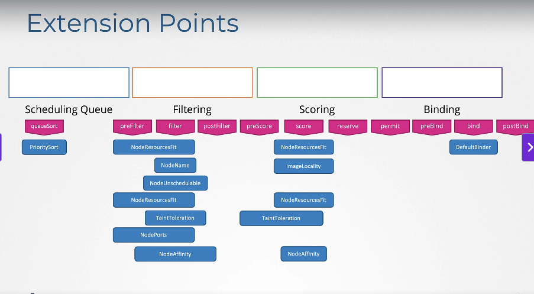

# Configuring Scheduler Profile

[Udemy Video Link](https://udemy.com/course/certified-kubernetes-administrator-with-practice-tests/learn/lecture/14295628#content)

## Notes

### Scheduling Phases

- **Scheduling Queue (phase)**: Where pods wait to be scheduled. Pods are sorted based on defined priorities using the `PrioritySort` plugin.
- **Filtering Phase**: Nodes that cannot run the pod are filtered out based on resource demands.
    - Plugins: `NodeResourcesFit`, `NodeName`, `NodeUnschedulable`
- **Scoring Phase**: Nodes are scored with different weights.
    - Plugins: `NodeResourcesFit`, `ImageLocality`
- **Binding Phase**: The pod is bound to the node with the highest score.
    - Plugin: `DefaultBinder`

### Extension Points



At each stage, there is an extension point with various options available.

### Scheduler Profile Creation

```yaml
apiVersion: kubescheduler.config.k8s.io/v1beta1
kind: KubeSchedulerConfiguration
profiles:
    - schedulerName: "default-scheduler"
        plugins:
            queueSort:
                enabled:
                    - name: "PrioritySort"
            preFilter:
                enabled:
                    - name: "NodeResourcesFit"
            filter:
                enabled:
                    - name: "NodeResourcesFit"
                    - name: "NodeName"
                    - name: "NodeUnschedulable"
            score:
                enabled:
                    - name: "NodeResourcesFit"
                    - name: "ImageLocality"
            bind:
                enabled:
                    - name: "DefaultBinder"
    - schedulerName: "high-priority-scheduler"
        plugins:
            queueSort:
                enabled:
                    - name: "PrioritySort"
            preFilter:
                enabled:
                    - name: "NodeResourcesFit"
            filter:
                enabled:
                    - name: "NodeResourcesFit"
                    - name: "NodeName"
                    - name: "NodeUnschedulable"
            score:
                enabled:
                    - name: "NodeResourcesFit"
                    - name: "ImageLocality"
            bind:
                enabled:
                    - name: "DefaultBinder"
    - schedulerName: "custom-scheduler"
        plugins:
            queueSort:
                enabled:
                    - name: "PrioritySort"
            preFilter:
                enabled:
                    - name: "NodeResourcesFit"
            filter:
                enabled:
                    - name: "NodeResourcesFit"
                    - name: "NodeName"
                    - name: "NodeUnschedulable"
            score:
                enabled:
                    - name: "NodeResourcesFit"
                    - name: "ImageLocality"
            bind:
                enabled:
                    - name: "DefaultBinder"
```

### Additional Reading Resources

- [Kubernetes Scheduling Code Hierarchy Overview](https://github.com/kubernetes/community/blob/master/contributors/devel/sig-scheduling/scheduling_code_hierarchy_overview.md)
- [Advanced Scheduling in Kubernetes](https://kubernetes.io/blog/2017/03/advanced-scheduling-in-kubernetes/)
- [How Does the Kubernetes Scheduler Work?](https://jvns.ca/blog/2017/07/27/how-does-the-kubernetes-scheduler-work/)
- [Stack Overflow: How Does Kubernetes Scheduler Work?](https://stackoverflow.com/questions/28857993/how-does-kubernetes-scheduler-work)
