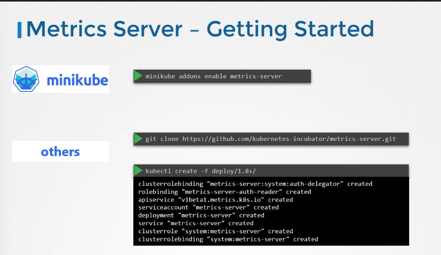

# Monitoring Cluster Components

[Udemy Video Link](https://udemy.com/course/certified-kubernetes-administrator-with-practice-tests/learn/lecture/14295996#content)

[Lab Link](https://uklabs.kodekloud.com/topic/practice-test-monitor-cluster-components-2/)

## Notes

- Kubernetes does not come with its own monitoring solutions. Therefore, you should use tools like Prometheus, Elastic, Datadog, etc.
- Heapster was the initial project for monitoring Kubernetes but is now deprecated.
- The Metrics Server is the recommended solution.
  - It collects metrics from each node and pod, aggregates them, and stores them in memory.
  - It includes a sub-component known as cAdvisor (Container Advisor).
    
- Deploying the Metrics Server:

```bash
# View metrics for nodes
kubectl top node
# View metrics for pods
kubectl top pod
```
