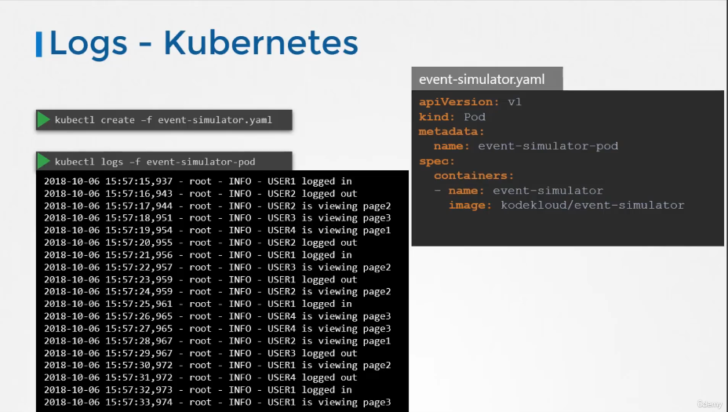
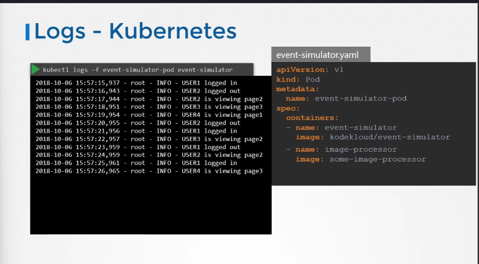

# Application Logs

Udemy Video Link: [Certified Kubernetes Administrator Course](https://udemy.com/course/certified-kubernetes-administrator-with-practice-tests/learn/lecture/14296002#content)

Lab Link: [Practice Test - Managing Application Logs](https://uklabs.kodekloud.com/topic/practice-test-managing-application-logs-2/)

## Notes

- Logs are specific to the container running within the pod.

- Displays the logs for the specified application within the pod. If there are multiple containers in a pod, you need to explicitly specify which container's logs you want to view.
