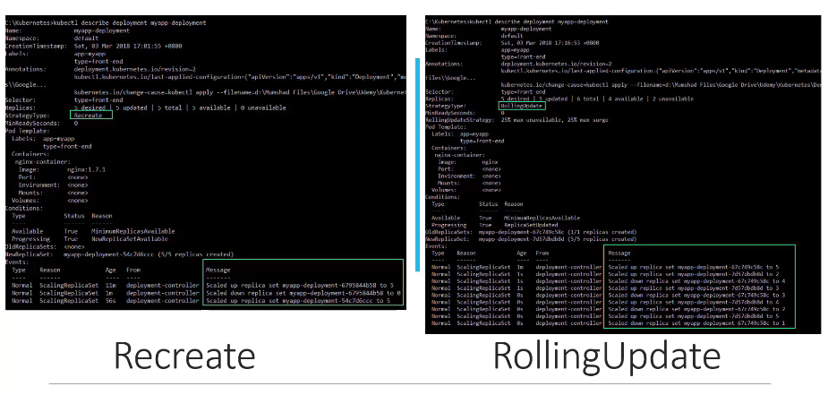
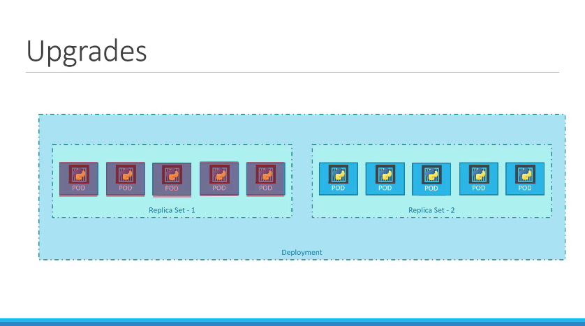
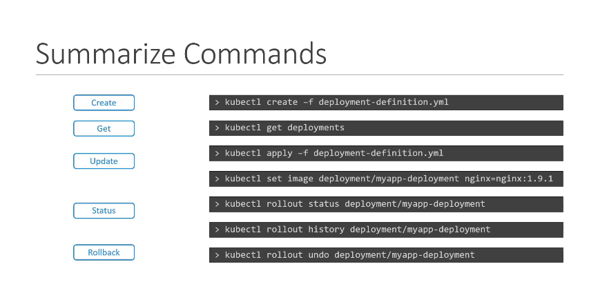

# Deployments (Updates & Rollback)

[Udemy Video Link](https://udemy.com/course/certified-kubernetes-administrator-with-practice-tests/learn/lecture/14296008#content)

[Lab Link](https://uklabs.kodekloud.com/topic/practice-test-rolling-updates-and-rollbacks-2/)

## Notes

```sh
kubectl rollout status deployment/myapp-deployment
```

- Displays the status of the deployment.

```sh
kubectl rollout history deployment/myapp-deployment
```

- Shows the revision history of the deployment.

### Deployment Strategies

- **Recreate Strategy**: Terminates all existing pods before creating new ones.
- **Rolling Update (default)**: Gradually replaces old pods with new ones.

- Differences can be observed using the `kubectl describe` command as shown in the image below:
  



- During upgrades, two ReplicaSets are created. The red ones represent the old version, and the blue ones represent the new version.
- To undo a change, run:

  ```sh
  kubectl rollout undo deployment/myapp-deployment
  ```



- Summary of essential commands.
