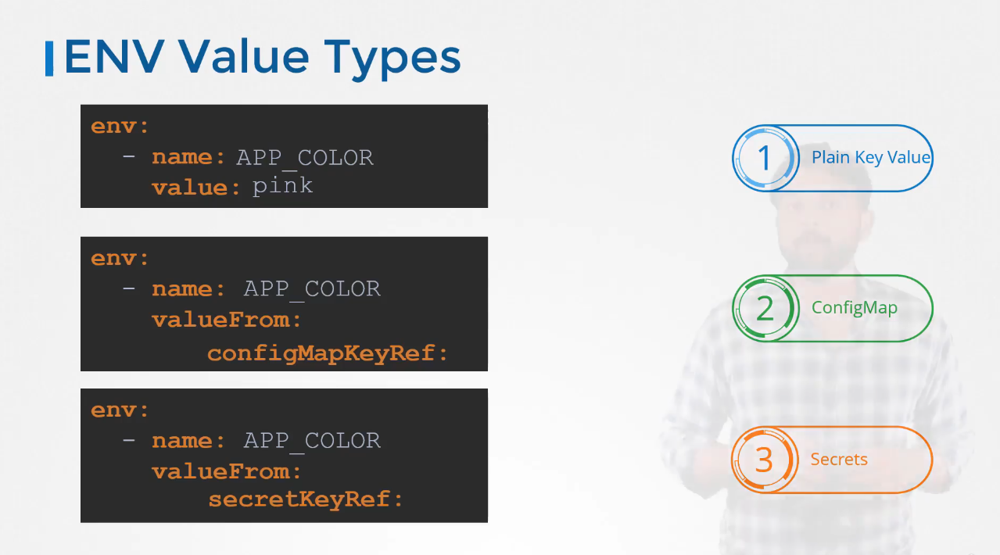
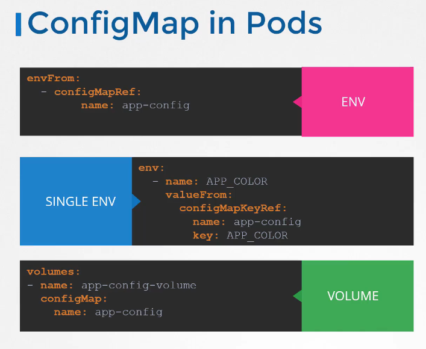

# Configuring Environment Variables

[Watch Video](https://udemy.com/course/certified-kubernetes-administrator-with-practice-tests/learn/lecture/14296026#overview)

Lab Link: https://uklabs.kodekloud.com/topic/practice-test-env-variables-2/

## Notes



### Example

```yaml
apiVersion: v1
kind: Pod
metadata:
    name: mypod
spec:
    containers:
    - name: mycontainer
        image: myimage
        env:
        - name: ENV_VAR_1
            value: "value1"
        - name: ENV_VAR_2
            value: "value2"
```

## Configuring ConfigMaps

[Watch Video](https://udemy.com/course/certified-kubernetes-administrator-with-practice-tests/learn/lecture/14412322#overview)


### Creating ConfigMaps

You can create ConfigMaps in two ways: imperatively or declaratively.

#### Imperative Commands

```bash
# Create ConfigMap with literals
kubectl create configmap <name> --from-literal=APP_COLOR=blue --from-literal=APP_MOD=prod

# Create ConfigMap from file
kubectl create configmap <name> --from-file=/path/to/file
```

#### Declarative Commands

```bash
# Create ConfigMap from YAML file
kubectl create -f <file-name>.yaml
```

```yaml
apiVersion: v1
kind: ConfigMap
metadata:
    name: app-config
data:
    APP_COLOR: blue
    APP_MODE: prod
```

## Injecting Values into Pods

