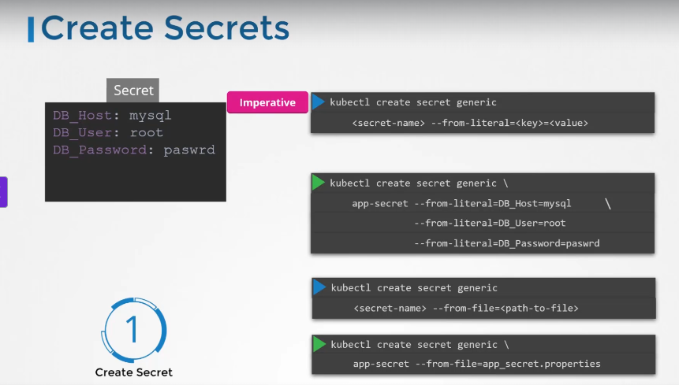
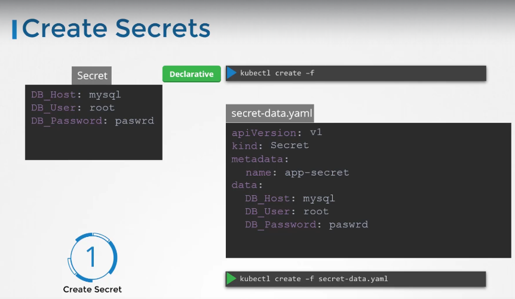
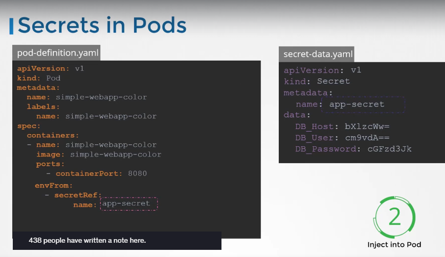

# Kubernetes Secrets

[Udemy Video Link](https://udemy.com/course/certified-kubernetes-administrator-with-practice-tests/learn/lecture/14296016#content)

Lab Link: https://uklabs.kodekloud.com/topic/practice-test-secrets-2/

## Notes

- Kubernetes Secrets are used to store sensitive data in an encoded format (base64). You can use a Linux command to encode the data.

### Creating Secrets

#### Imperative Way

#### Declarative Way

### Retrieving Secrets

- To retrieve secrets, use the following commands:

  - `kubectl get secrets`
  - `kubectl describe secrets`
  - These commands show attributes but hide values.

- To see encoded values, use:
  - `kubectl get secret app-secret -o yaml`

### Using Secrets

- Secrets can be referenced as environment variables:
  

### Important Considerations

- Secrets are encoded, not encrypted.
  - Do not check secret objects into source control.
  - Secrets are not encrypted in ETCD by default; consider enabling encryption at rest.
  - Anyone with permissions to create pods/deployments in the same namespace can access secrets; configure RBAC accordingly.
  - Consider using third-party secret management tools like HashiCorp Vault.

### Best Practices

- Remember that base64 encoding is not secure; anyone with the encoded secret can decode it.
- Kubernetes documentation and various blogs refer to secrets as a "safer option" for storing sensitive data. They are safer than plain text as they reduce the risk of accidental exposure.
- The safety of secrets depends on best practices:
  - Do not check secret definition files into source code repositories.
  - Enable Encryption at Rest for secrets in ETCD.

### Kubernetes Handling of Secrets

- A secret is only sent to a node if a pod on that node requires it.
- Kubelet stores the secret in a `tmpfs` to avoid writing it to disk.
- Once the pod using the secret is deleted, Kubelet deletes its local copy of the secret data.

### Further Reading

- Read about the protections and risks of using secrets [here](https://kubernetes.io/docs/concepts/configuration/secret/).

### Alternatives

- Consider using tools like Helm Secrets or HashiCorp Vault for better handling of sensitive data in Kubernetes. Future lectures may cover these tools.
