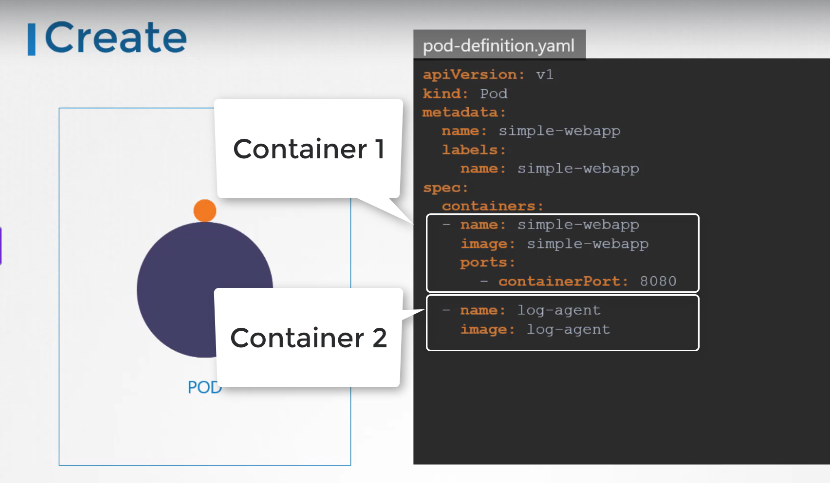
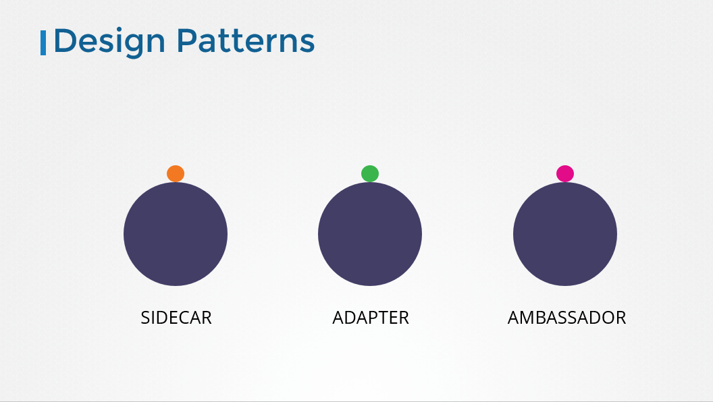

# Multi-Container Pods

[Udemy Video](https://udemy.com/course/certified-kubernetes-administrator-with-practice-tests/learn/lecture/15029472#overview)

[Lab Link](https://uklabs.kodekloud.com/topic/practice-test-multi-container-pods-2/)

## Notes



- Multi-container pods are a fundamental concept in Kubernetes where multiple containers run within a single pod. These containers are created and destroyed together, sharing the same network namespace and volumes, which allows them to communicate with each other easily and share data.

```yaml
apiVersion: v1
kind: Pod
metadata:
    name: multi-container-pod
spec:
    containers:
        - name: nginx-container
            image: nginx
            ports:
                - containerPort: 80
        - name: sidecar-container
            image: busybox
            command: ['sh', '-c', 'echo Hello from the sidecar container! && sleep 3600']
```

- There are several design patterns for multi-container pods in Kubernetes, including:
  - **Sidecar**: A helper container that extends and enhances the functionality of the main container.
  - **Adapter**: A container that transforms data from one format to another, making it compatible with other services.
  - **Ambassador**: A container that acts as a proxy, facilitating communication between the main container and external services.


