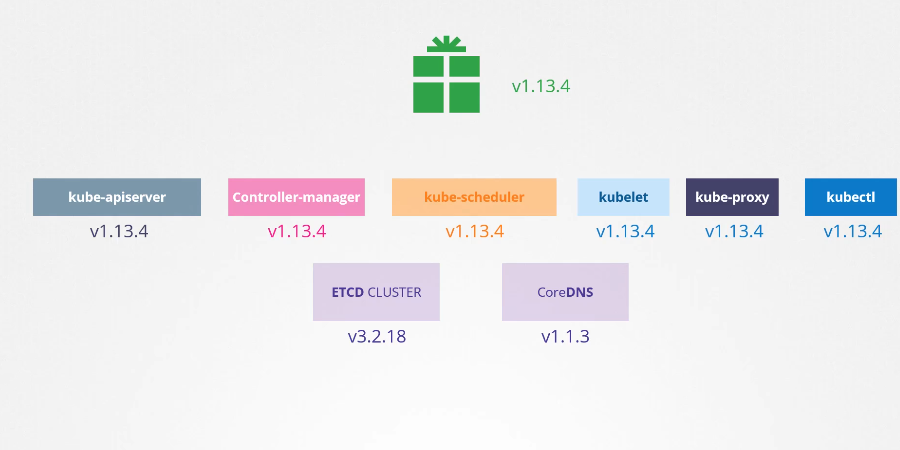

# Kubernetes Releases

[Udemy Video Link](https://udemy.com/course/certified-kubernetes-administrator-with-practice-tests/learn/lecture/14296052#content)

## Notes

- All releases can be found [here](https://github.com/kubernetes/kubernetes/releases).
- Version information for core components:
    

For more information, refer to the [Kubernetes API Overview](https://kubernetes.io/docs/concepts/overview/kubernetes-api/).

Additional resources (not required for the exam):
- [API Conventions](https://github.com/kubernetes/community/blob/master/contributors/devel/sig-architecture/api-conventions.md)
- [API Changes](https://github.com/kubernetes/community/blob/master/contributors/devel/sig-architecture/api_changes.md)
