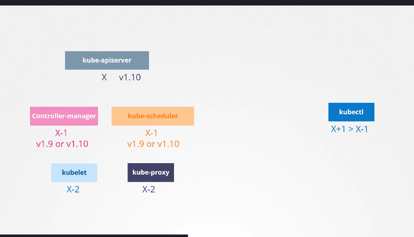
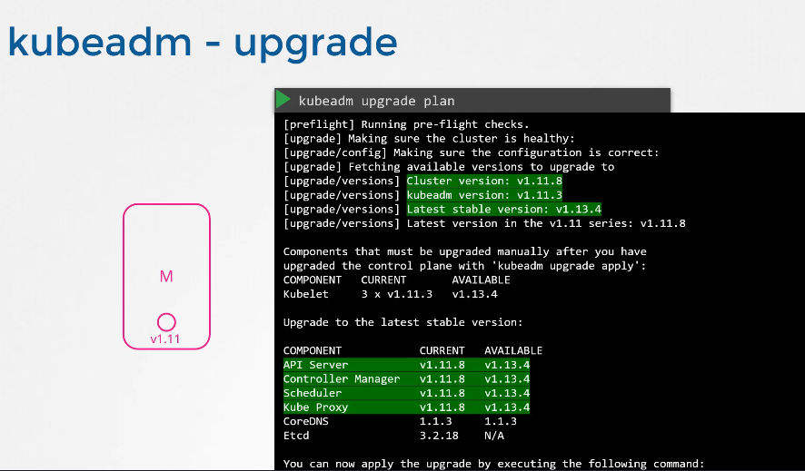
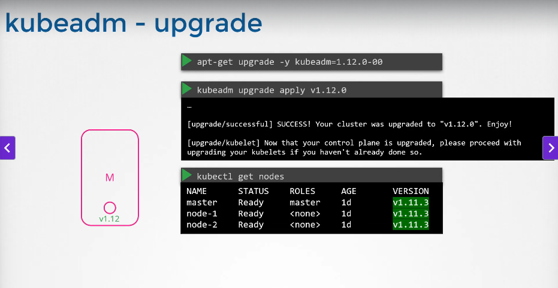
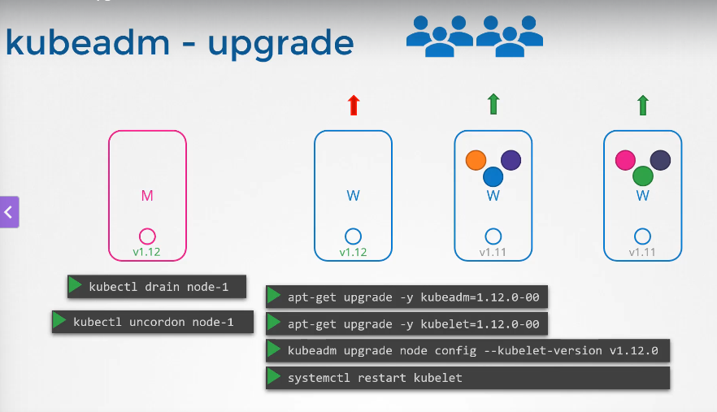

# Cluster Upgrades

[Udemy Video Link](https://udemy.com/course/certified-kubernetes-administrator-with-practice-tests/learn/lecture/14296062#content)

Demo: [Cluster Upgrade Demo](https://udemy.com/course/certified-kubernetes-administrator-with-practice-tests/learn/lecture/24458188#content)

Lab Link: https://uklabs.kodekloud.com/topic/practice-test-cluster-upgrade-process-2/

## Notes

- If the kube-apiserver is v1.10, then the controller-manager, kube-scheduler, kubelet, and kube-proxy must be v1.10 or lower.
    - The kubectl command can be one version higher or lower.
- This makes upgrades more flexible.
- Version compatibility:
    
- During a master node upgrade, schedulers and other components are down. Ensure your applications or nodes do not fail during this period, as they will remain broken until the upgrade completes.

### Node Upgrade Strategies

1. **All at once**
2. **Rolling (one at a time)** - Pods are moved to other nodes.
3. **Blue/Green (canary)** - Add new nodes with the latest version and migrate workloads.

## Upgrading with Kubeadm

- Kubeadm upgrade plans and versions:
    
    
- Kubelets run control plane components and only operate on the master node.

    ```bash
    apt-get upgrade -y kubelet
    systemctl restart kubelet
    ```

    
