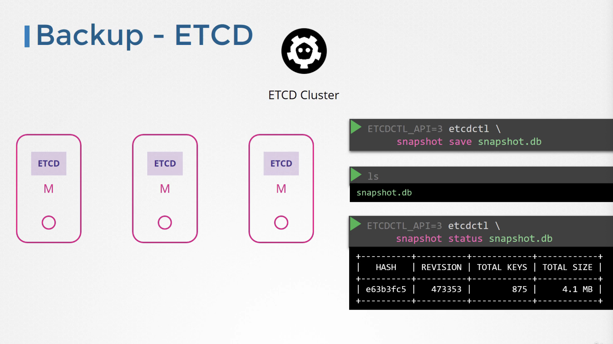
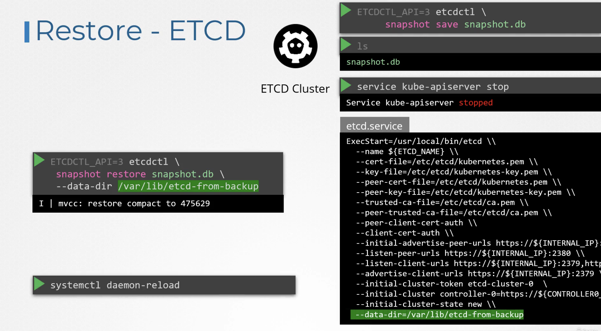

# Backup and Restore Methods

[Udemy Video Link](https://udemy.com/course/certified-kubernetes-administrator-with-practice-tests/learn/lecture/14296066#content)

Lab Link 1: https://uklabs.kodekloud.com/topic/practice-test-backup-and-restore-methods-2/

Lab Link 2: https://uklabs.kodekloud.com/topic/practice-test-backup-and-restore-methods-2-3/

## Notes

- Backup resource configurations by querying the kube-apiserver.
- Use Velero to back up the Kubernetes cluster via the kube-apiserver, or perform manual backups.
  ```sh
  # Backup all resources and services
  kubectl get all --all-namespaces -o yaml > all-services.yaml
  ```



- Backup ETCD cluster:
  - Configure the data directory for backups.
  - Take a snapshot of the ETCD database using `etcdctl`.



- Restore ETCD cluster:
  - Stop the kube-apiserver and run the `etcdctl snapshot restore` command.
  - Specify the `data-dir` to prevent new clusters from joining.
  - Reload the daemon and restart the ETCD service.
  - Restart the kube-apiserver to restore the cluster to its original state.

## Working with ETCDCTL

`etcdctl` is a command-line client for ETCD.

In all Kubernetes Hands-on labs, the ETCD key-value database is deployed as a static pod on the master node, using version v3.

To use `etcdctl` for backup and restore tasks, set the `ETCDCTL_API` to 3:

```sh
export ETCDCTL_API=3
```

On the Master Node:

To see all options for a specific sub-command, use the `-h` or `--help` flag.

For example, to take a snapshot of ETCD, use:

```sh
etcdctl snapshot save -h
```

```sh
# Example command
ETCDCTL_API=3 etcdctl --endpoints=https://[127.0.0.1]:2379 \
--cacert=/etc/kubernetes/pki/etcd/ca.crt \
--cert=/etc/kubernetes/pki/etcd/server.crt \
--key=/etc/kubernetes/pki/etcd/server.key \
snapshot save /opt/snapshot-pre-boot.db
```

Note the mandatory global options:

- `--cacert`: Verify certificates of TLS-enabled secure servers using this CA bundle.
- `--cert`: Identify secure client using this TLS certificate file.
- `--endpoints=[127.0.0.1:2379]`: Default endpoint as ETCD runs on the master node and is exposed on localhost 2379.
- `--key`: Identify secure client using this TLS key file.

Similarly, use the help option for snapshot restore to see all available options:

```sh
etcdctl snapshot restore -h
```

```sh
# Example command
ETCDCTL_API=3 etcdctl --endpoints=https://[127.0.0.1]:2379 \
--cacert=/etc/kubernetes/pki/etcd/ca.crt \
--cert=/etc/kubernetes/pki/etcd/server.crt \
--key=/etc/kubernetes/pki/etcd/server.key \
snapshot restore /opt/snapshot-pre-boot.db
```

- next, you want to update the etcd-data section with the data-dir set to what you think is best.

For a detailed explanation on using the `etcdctl` command-line tool and working with the `-h` flags, refer to the solution video for the Backup and Restore Lab.

## References

- https://kubernetes.io/docs/tasks/administer-cluster/configure-upgrade-etcd/#backing-up-an-etcd-cluster

- https://github.com/etcd-io/website/blob/main/content/en/docs/v3.5/op-guide/recovery.md

- https://www.youtube.com/watch?v=qRPNuT080Hk
